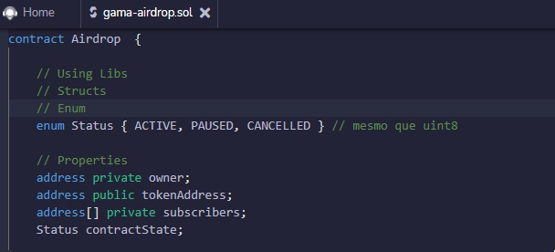
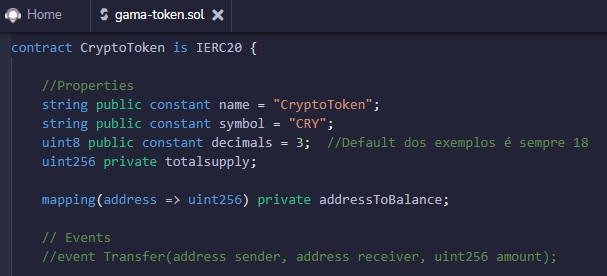

  
## AirDrop & Token

  
## AirDrop
  

  

 

<b>Status:</b> ACTIVE, PAUSED, CANCELLED.
 
<b>Propriedades:</b> owner; tokenAddress; subscribers; contractState.
 
<b>Modificadores:</b> isOwner (Quem tenta enviar não é o dono.).
 
<b>Eventos:</b> NewSubscriber.
 
<b>Construtor:</b> owner; tokenAddress; contractState.
 
<b>Funções:</b>

- Subscribe
- Execute
- State
- Privada (Já subscrito.)
- Kill

## Token

  

 

<b>Construtor:</b> totalsupply; addressToBalance.
 
<b>Propriedades:</b> name; symbol; decimals.
 
<b>Funções:</b>
  - totalSupply
  - balanceOf
  - transfer

